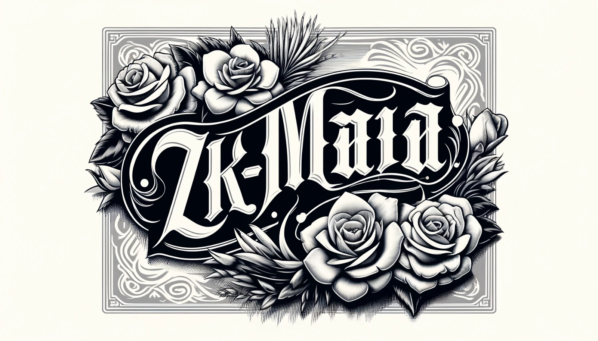

<p align="center">
  
</p>

### Project Name: zk-maria

### Tagline:
Securely verify age for government permissions without revealing identity.

### The problem it solves:
Ensures individuals meet age requirements for government permissions while preserving their privacy by not revealing personal information.

### Challenges we ran into:
- Integrating OCR for accurate text extraction from IDs.
- Training and deploying ONNX models for age calculation.
- Implementing verifiable ML models using GizaModel for secure, provable age verification.

### Technologies we used:
- **Python**: Programming language for developing the project.
- **EasyOCR**: Library for extracting text from images.
- **OpenCV**: Image processing library.
- **ONNX Runtime**: For running machine learning models.
- **GizaModel**: For verifiable ML inference using Zero-Knowledge proofs.
- **Giza Actions**: For task and action orchestration.
- **PIL (Pillow)**: Python Imaging Library for image manipulation.

### How it works:
1. **Image Preprocessing**: Convert the ID image to grayscale and apply thresholding to prepare it for OCR.
2. **OCR Text Extraction**: Use EasyOCR to extract text from the preprocessed image.
3. **Birthdate Extraction**: Identify and extract the birthdate from the OCR results.
4. **Age Calculation**: Use an ONNX model to calculate the age based on the extracted birthdate.
5. **Verifiable Inference**: For secure verification, use GizaModel to perform verifiable inference, providing a proof that the age calculation was correct.
6. **Privacy Preservation**: Only the calculated age and proof of calculation are shared, ensuring the individual's identity remains private.

### Diagram (image):

Here is a simple diagram to illustrate the workflow:

```plaintext
+------------------+        +------------------+        +------------------+        +------------------+
|                  |        |                  |        |                  |        |                  |
|   Input ID Image +------->+   Preprocess     +------->+  OCR Text        +------->+  Extract Birthdate|
|                  |        |   Image          |        |  Extraction      |        |                  |
|                  |        |                  |        |                  |        |                  |
+------------------+        +------------------+        +------------------+        +--------+---------+
                                                                                             |
                                                                                             v
                                                                                   +---------+---------+
                                                                                   |                   |
                                                                                   |   Age Calculation |
                                                                                   |   with ONNX       |
                                                                                   |                   |
                                                                                   +---------+---------+
                                                                                             |
                                                                                             v
                                                                                   +---------+---------+
                                                                                   |                   |
                                                                                   |   Verifiable      |
                                                                                   |   Inference with  |
                                                                                   |   GizaModel       |
                                                                                   |                   |
                                                                                   +---------+---------+
                                                                                             |
                                                                                             v
                                                                                   +---------+---------+
                                                                                   |                   |
                                                                                   |  Output Age and   |
                                                                                   |  Proof            |
                                                                                   |                   |
                                                                                   +-------------------+
```

This diagram shows the step-by-step process from inputting the ID image to producing the age and proof of calculation without revealing personal identity details.


#### How to Replicate the Process:

1. **Set Up Environment**:
   - Install necessary libraries:
     ```bash
     pip install easyocr opencv-python-headless pillow numpy onnxruntime giza_actions
     ```

2. **Preprocess the Image**:
   - Convert the image to grayscale and apply thresholding for better OCR results.

3. **Extract Text Using OCR**:
   - Use EasyOCR to extract text from the image, focusing on retrieving the birthdate.

4. **Calculate Age Using ONNX Model**:
   - Use an ONNX model to calculate age based on the extracted birthdate. Train the model with synthetic data to ensure accuracy. This is just an example of how you can integrate an ML model. We need to train a neural network to recognize and verify Mexican ID.    

5. **Perform Verifiable Inference with GizaModel**:
   - Use GizaModel to perform verifiable inference, ensuring the integrity of the age calculation.

6. **Generate and Deploy Actions**:
   - Define tasks and actions using Giza Actions SDK. Deploy these actions to enable processing requests.

7. **Monitor and Manage Deployments**:
   - Use Giza Platform to manage and monitor action deployments. Ensure smooth operations and quick troubleshooting.

### Code Example:

Here’s an example of how to set up the tasks and actions:

```python
from giza_actions.action import Action, action
from giza_actions.task import task
import easyocr
import cv2
import numpy as np
from PIL import Image
from datetime import datetime
import onnxruntime as ort
import json
import re
from giza_actions.model import GizaModel

@task
def preprocess_image(image_path):
    img = Image.open(image_path)
    img = cv2.cvtColor(np.array(img), cv2.COLOR_BGR2GRAY)
    _, img = cv2.threshold(img, 150, 255, cv2.THRESH_BINARY + cv2.THRESH_OTSU)
    return img

@task
def perform_ocr(img):
    reader = easyocr.Reader(['es'])
    result = reader.readtext(img, detail=0)
    return result

@task
def extract_birthdate(result):
    extracted_text = "\n".join(result)

